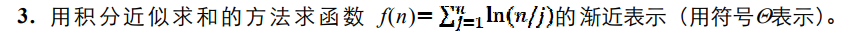
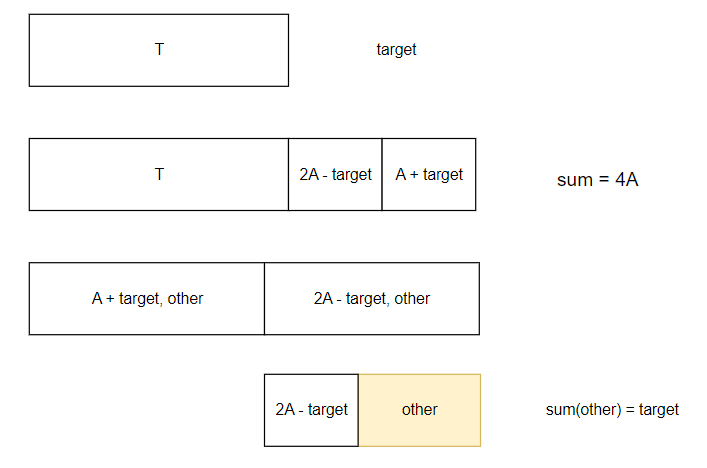

# 一、算法分析基础知识

## 记号

$$
f(n) = 10n^2 + 5n \\
g(n) = 2^n \\
$$

- $O$：**最坏情况**，函数复杂度小于等于
  
  $$
  (n) = O(n^2) \\
  f(n) = O(f(n))
  $$

- $\Omega$：**最优情况**，复杂度大于等于

- $\Theta$：**精确情况**，复杂度等于
  
  当上界和下界相等时，用 $\Theta$ 来描述算法的复杂度

## 复杂度分析：主定理

### 公式

$$
T(n) = a T(\frac{n}{b}) + f(n), \quad a \geq 1, b > 1
$$

1. 若存在 $\epsilon > 0$，$f(n) = \Large O(n^{\log_b(a) - \epsilon})$，那么 $T(n) = \Large \Theta(n^{\log_b(a)})$
2. 如果 $f(n) = \Large \Theta(n^{\log_b(a)})$，那么 $T(n) = \Large \Theta(n^{\log_b(a)} \cdot \log n)$
3. 若存在 $\epsilon > 0$，$f(n) = \Large \Omega(n^{\log_b(a) + \epsilon})$，并且存在常数 $c < 1$ 使得 $n \to \infty : \large af(\frac{n}{b}) \leq cf(n)$，则 $T(n) = \Theta(f(n))$

### 分析

- 每个问题会分成 $a$ 个子问题
- 问题可以划分 $\Large log_b n$ 次，每次划分都伴随着 $f(n)$
- 对应到递归树中，最终叶子节点的复杂度是 $\Theta(1)$，共有 $\Large a^{log_b n}$ 个叶子节点，应用换底公式可得 $\Large a^{log_b n} = n^{log_b a}$
- 问题可以简化为 $T(n) = p f(n) + \Large n^{log_b a}$
- 求复杂度等价于比较**处理所有叶子节点**更耗时还是**处理所有划分**更耗时
- 第三种情况中为什么多了：存在常数 $ c < 1 $ 使得 $n \to \infty : \large af(\frac{n}{b}) \leq cf(n)$
  - 每次划分后 $f(n)$ 并不会保持不变，而是会跟着划分 $\large af(\frac{n}{b})$
  - $n \to \infty : \large af(\frac{n}{b}) \leq cf(n)$  要求 $f(n)$ 划分的复杂度不能大于问题本身，否则没必要分治

### 参考文献

- [深入浅出理解主定理原理(Master theorem)如何计算递归时间复杂度](https://blog.restkhz.com/post/how-master-theorem-works)
- [Wiki 主定理](https://zh.wikipedia.org/wiki/%E4%B8%BB%E5%AE%9A%E7%90%86)

## 例题：递归方程

某递归算法的时间复杂度 $T(n)$ 满足递归方程： $T(n) = 2T(n/2) + bn$ ($n \geq 2$) 且 $T(1) = a$，其中 $n = 2^k$，$a, b, k$ 均为正整数。$T(n)$ 可用 $\Theta$ 表示为

- 展开法
  
  $$
  \begin{align*}
  T(n) &= 2T\left(\frac{n}{2}\right) + bn \\
     &= 2\left(2T\left(\frac{n}{4}\right) + \frac{1}{2}bn\right) + bn \\
     &= 4T\left(\frac{n}{4}\right) + 2bn \\
     &= 2^k T\left(\frac{n}{2^k}\right) + kbn \\
  \end{align*}
  $$
  
  $$
  n = 2^k, k=log_2 n
  $$
  
  $$
  \begin{align*}
  T(n) &= 2^k T(1) + kbn \\
     &= an + bn \cdot \log n \\
     &= \Theta(n log n)
  \end{align*}
  $$

- 主定理
  
  $$
  a = 2, b = 2, f(n) = bn
  $$
  
  $$
  f(n) = \Theta(\large n^{log_b a}) = \Theta(n)
  $$
  
  $$
  T(n) = \Theta(n log n)
  $$

## 例题：递归方程


$$
a = 3, b = 2, f(n) = n ln n
$$

$$
n^{log_b a} = n^{log_2 3} = \Omega(f(n))
$$

$$
T(n) = \Theta(n^{log_2 3})
$$

## 例题：递归方程


$$
\begin{aligned}
T(n) &= T(n/4) + 2 T(n/8) + T(n/16） + \frac{3}{4}cn \\
     &= 3T(n/8) + 2 T(n/16) + cn \\
     &= 3T(\frac{n}{2^3}) + 2 T(\frac{n}{4^2}) + cn
\end{aligned}
$$

$$
2^k = n, k = log_2 n \\
4^m = n, m = log_4 n\\ 
T(1) = 1
$$

$$
T(n) = log_2 n T(1) + log_4 n T(1) + cn = log_2n + log_4n + cn = \Theta(n)
$$

## 例题：复杂度对比


- 算法 A
    $$
    T(n) = 5T(n/2) + cn
    $$

    $$
    a = 5, b = 2, f(n) = cn
    $$

    $$
    n^{log_ba} = n^{log_25} = \Omega(cn)
    $$

    $$
    T(n) = \Theta(n^{log_25})
    $$

- 算法 B
    $$
    T(n) = 2T(n-1) + cn, \text{设 T(0) = 1}
    $$

    $$
    T(n) = 4T(n-2) + c(n-1) + cn = 2^kT(n-k) + kcn - (k-1)c
    $$

    $$
    \text{令} k = n, T(n) = 2^n + cn^2 - c(n-1) = \Theta(2^n)
    $$

- 算法 C
    $$
    T(n) = 9T(n/3) + cn^2
    $$

    $$
    a = 9, b = 3, f(n) = cn^2
    $$

    $$
    n^{log_ba} = n^{2} = \Theta(f(n))
    $$

    $$
    T(n) = \Theta(n^2logn)
    $$

- 故在最坏情况下算法复杂度 $B > A > C$，算法 C 的复杂度最低

## 例题：积分近似求和求函数渐近表示


$$
f(n) = \sum_1^n (ln n - ln j) = n lnn - \sum_1^n lnj 
$$

$$
f(n) \geq nlnn - \int_1^n lnx dx = nlnn - (xlnx - x)|_1^n = n - 1
$$

- 到这，证不出来了，复习提要的证明有错

- 由定积分定义
    $$
    \begin{align}
    \lim_{n \to \infty} \frac{\sum_1^n n/j}{n} & = \lim_{n \to \infty} \frac{1}{n} \sum_1^n ln\frac{1}{j/n} \\ 
    									    & = \int_0^1 ln\frac{1}{x} dx \\
    									    &= - \int_0^1 lnxdx \\
    									    &= -(xlnx-x)|_0^1 \\
    									    &=-(-1) \\
    									    &= 1
    \end{align}
    $$

- 即 $lim_{n \to \infty} \frac{f(n)}{n} = 1$，故 $f(n) = \Theta(n)$

## 例题：冒泡排序


设上述算法中元素比较的最多次数为 $T(n)$，则满足递归方程 $T(n) = T(n-1) + n -1$，$T(1) = T(0) = 0$

$$
\begin{align*}
T(n) &= T(n-1) + n - 1 \\
     &= T(n-2) + (n-2) + (n-1) \\
     &= T(n-3) + (n-3) + (n-2) + (n-1) \\
     &= T(n-k) + kn - \frac{k(k+1)}{2} \\
     &= T(1) + n(n-1) - \frac{n(n-1)}{2} \\
     &= \frac{1}{2} n(n-1) \\
     &= \Theta(n^2)
\end{align*}
$$

## 例题：图的 DFS

假设图 $G=\big <V, E \big >$ 用**邻接矩阵**表示， $n=|V|, m=|E|$。分析图的深度优先遍历算法 DFS 的时间复杂度。

1. 算法 DFS 中有哪些基本操作？各基本操作耗费时间是多少？
   
   算法 DFS 中基本操作包括：访问结点、访问相邻结点
   
   图中每个结点都恰好访问 1 次，访问结点的总次数为 n，耗费时间为 $\Theta(n)$；
   
   访问相邻节点即扫描邻接矩阵的一行，因此检测总耗费时间为 $\Theta(n^2)$

2. 请根据基本操作的耗费时间，分析得出算法 DFS 的时间复杂度。
   
   算法 DFS 的时间复杂度主要由访问结点的时间、访问相邻结点的时间来决定，其他运算耗费时间不超过这两部的耗费时间。
   
   故算法 DFS 时间复杂度为 $\Theta(n) + \Theta(n^2) = \Theta(n^2)$。

# 二、算法设计基本方法

## 例题：求逆序对


### 归并思想求逆序对

#### 分析

- 对于归并排序过程中的两个数组 $a[l, ..., m], b[m+1, ..., r]$，比较两个数组元素的指针分别为 $i,j$

    在比大小过程中，若有 $a[i] > b[j]$ 则 $(a[i \sim m], b[j])$ 均为逆序对，$cnt += m - i + 1$

#### 代码

- [判题机](https://www.luogu.com.cn/problem/P1908)

```cpp
#include <iostream>
#include <cstdio>
using namespace std;

typedef long long LL;
const int N = 1e6 + 10;
int n, a[N];
int tmp[N];
LL cnt;

void reverse_merge(int l, int r) {
    if(l >= r) return;
    int m = l + r >> 1;
    reverse_merge(l, m), reverse_merge(m + 1, r);
    int i = l, j = m + 1, k = 0;
    while(i <= m && j <= r) {
        if(a[i] <= a[j]) {
            tmp[k++] = a[i++];
        } else {
            cnt += m - i + 1;
            tmp[k++] = a[j++];
        }
    }
    while(i <= m) tmp[k++] = a[i++];
    while(j <= r) tmp[k++] = a[j++];
    for(int i=l, k = 0; i<=r; i++, k++) {
        a[i] = tmp[k];
    }
}

int main() {
    cin >> n;
    for(int i=0; i<n; ++i) scanf("%d", &a[i]);
    reverse_merge(0, n-1);
    printf("%ld\n", cnt);
    return 0;
}
```

### 画图表示求解过程


## 例题：文件存储问题


### 要求文件存放数量最多

- 算法：贪心算法
- 思路：首先对文件按大小进行排序，每次放入占用空间最小的文件
- 时间复杂度：$O(nlogn) + O(n) = O(nlogn)$

### 要求剩余空间最小

- 算法：动态规划
- 思路
    - 设 $v[i]$ 为文件大小，$w[i]$ 为空间占用，其中 $v[i]=w[i]$
    - 状态定义：$dp[i][j]$ 考虑前 $1 \sim i$ 个文件，总体积不超过 $j$ 的最大空间占用
    - 状态转移
        1. 若 $j \geq v[i]$：$dp[i][j] = max(dp[i-1][j], dp[i-1][j-v[i]]+w[i])$
        2. 否则：$dp[i][j] = dp[i-1][j]$

## 例题：作业分配


- $f_i + t_i \leq f_j$ 的意思是作业 $i$ 还未完成时，不能加工作业 $j$

- 加工时间 $t[i]$，效益 $v[i]$

- 状态定义：$dp[i][j]$ 考虑前 $1 \sim i$ 个作业，加工时间不超过 $j$ 的最大效益

- 状态转移

    1. 若 $j \geq t[i]$：$dp[i][j] = max(dp[i-1][j], dp[i-1][j-t[i]]+v[i])$
    2. 否则：$dp[i][j] = dp[i-1][j]$

- 时间复杂度

    需要计算所有所有物体和所有时间下的状态，复杂度为 $O(nd)$

## 例题：01背包问题的算法讨论


- 设物品数量为 $n$，背包容量为 $m$

| 算法     | 思路                                                         | 时间复杂度 | 性能                                                        |
| -------- | ------------------------------------------------------------ | ---------- | ----------------------------------------------------------- |
| 动态规划 | $dp[i][j]$ 表示考虑前 $1 \sim i$ 个物品，总体积不超过 $j$ 的最大价值，填充 $dp[i][j]$，$dp[n][m]$ 即为答案 | $O(nm)$    | 空间复杂度为 $O(nm)$（优化后可实现 $O(n)$），总能找到最优解 |
| 回溯     | 尝试所有物品选择方案，选择价值最高的方案                     | $O(2^n)$   | 可以找到最优解，但在物品数量较大时效率较低                  |
| 贪心     | 按照性价比由高到低选择物品                                   | $O(nlogn)$ | 不能保证总是得到最优解                                      |

## 例题：找到数组中最大的两个元素

假定 $n=2^k$（k 为正整数）。设计一个分治算法在数组 $A[1..n]$ 中找最大元素和第二大元素， 要求比较次数为 $\frac{3n}{2}-2$

### 分析

1. 用文字简要描述递归形式分治算法的基本思路（不用写出完整代码）
   
   1. 当 n=2 时，直接比较即可找到最大值和最小值
   
   2. 当 n>2 时，递归求出 $A[1..\frac{n}{2}]$ 和  $A[\frac{n}{2}..n]$ 中的最大元素和次大元素，分别标记为 $[x_1,y_1], [x_2,y_2]$，通过比较可以找出最大元素和次大元素
      
      ```python
      if x1 > x2:
          x = x1
          if x2 > y1:
              y = x2
          else:
              y = y1
      else:
          x = x2
          if y2 > x1:
              y = y2
          else:
              y = x1
      ```

2. 请给出算法中比较次数 $T(n)$ 满足的递归方程，并证明  $T(n) = \frac{3n}{2}-2$
   
   $$
   T(n) = 2T(\frac{n}{2}) + 2, T(2) = 1
   $$
   
   $+2$ 是因为 if 判断需进行两次
   
   - 主定理
     
     $$
     a = 2, b = 2, f(n) = 2
     $$
     
     $$
     n^{log_b a} = O(f(n))
     $$
     
     $$
     T(n) = \Theta(n)
     $$
     
     啊？只能给出数量级😭
   
   - 展开
     
     $$
     \begin{align*}
     T(n) &= 2^2 T(\frac{n}{2^2}) + 2 + 2^2 \\ 
     &= 2^k T(\frac{n}{2^k}) + 2^1 + 2^2 + ... + 2^k \\ 
     &= 2^k T(\frac{n}{2^k}) + \frac{2 \cdot (2^k - 1)}{2 - 1} \\
     \end{align*}
     $$
     
     $$
     = 2^{k+1}, k = log_2{\frac{n}{2}}
     $$
     
     $$
     \begin{align*}
     T(n) &= \frac{n}{2} + n - 2 \\ 
     &= \frac{3n}{2} - 2
     \end{align*}
     $$

### 代码

```cpp
#include <iostream>
#include <vector>
#include <algorithm>
using namespace std;

const int INT_MIN = -1;

struct MaxVal {
    int max1;  // 最大值
    int max2;  // 第二大值
};

MaxVal findMaxTwo(const vector<int>& a, int l, int r) {
    if (l == r) {
        return {a[l], INT_MIN}; 
    }

    if (r - l == 1) {
        if (a[l] > a[r]) {
            return {a[l], a[r]};
        } else {
            return {a[r], a[l]};
        }
    }

    int m = (l + r) / 2;
    MaxVal left = findMaxTwo(a, l, m);
    MaxVal right = findMaxTwo(a, m + 1, r);

    vector<int> candidates = {left.max1, left.max2, right.max1, right.max2};
    sort(candidates.begin(), candidates.end(), greater<int>()); // 按降序排序
    return {candidates[0], candidates[1]};
}

int main() {
    int n;
    cin >> n;
    vector<int> a(n);
    for (int i = 0; i < n; ++i) {
        cin >> a[i];
    }
    MaxVal result = findMaxTwo(a, 0, n - 1);
    cout << "最大的数是: " << result.max1 << endl;
    cout << "第二大的数是: " << result.max2 << endl;
    return 0;
}
```

## 例题：找出数组中最小的 t 个元素


1. 使用 SELECT 函数找到最小元素 $x$
2. 使用 SELECT 函数找到第 t 小的元素 $y$
3. 扫描数组 A，将 $x \leq a[i] \leq y$ 的元素交换到 $A[1...t]$

调用两次 SELECT 的时间复杂度为 $\Theta(n)$，扫描数组并交换元素的时间复杂度为 $\Theta(n)$，因此算法的时间复杂度为 $\Theta(n)$

## 例题：Dijkstra


### (1) Dijkstra 的基本思路

1. 准备一个 dist 数组，$dist[i]$ 表示起点到节点 i 的距离

2. 初始化 $dist[start]=0$，start 为起点编号，$dist[x] = \infty, x \neq start$

3. 查找 dist 中未处理过且距离最小的节点 x，遍历 x 的所有出边 $\big <x,y \big >$，y 是未处理过的节点
   
   1. 若 $dist[y] > dist[x] + |\big <x,y \big >|$，则更新距离
   2. 标记 x 已经处理

### (2) Dijkstra 处理负权图

不能，图中存在负权边

由于 $dist[a] < dist[b] < dist[c]$，且 a 没有出边，因此 b 的出边比 c 先更新，也先标记，而 c 到 b 的边是负权边 $dist[c] + (-4) = 5$ ，小于已经标记的 $dist[b] = 7$，却没有更新

### (3) Dijkstra 求最短路径过程

| 迭代节点 | s   | a   | b   | c   | d   | e   |
| ---- |:---:|:---:|:---:|:---:|:---:|:---:|
| s    | 0   | 2   | 10  |     |     |     |
| a    |     |     |     | 4   | 7   |     |
| c    |     |     |     |     | 6   | 7   |
| d    |     |     | 8   |     |     |     |
| e    |     |     |     |     |     |     |
| b    |     |     |     |     |     |     |
|      | 0   | 2   | 8   | 4   | 6   | 7   |

## 例题：最小生成树


### （1）求解最小成本森林

- 对于不连通图
  
  - Prim 算法从某点开始依次在该点所在连通分支中加边，最终能得到**该连通分支**的最小生成树
  - Kruskal 算法按照边权由小到大依次考虑边的加入，能求得**所有连通分支**的最小生成树
  
  当图不连通时，需要在每个连通分支上单独运行 Prim 算法来处理。因此 Kruskal 算法更适合求解最小成本生成森林问题

### （2）求最小成本森林


## 例题：最大间隔聚类


- 最大间隔聚类问题可以用 Kruskal 算法解决

- Kruskal 算法
  
  1. 初始化 n 个连同分支，**对应 n 个聚类**
  
  2. 从小到大枚举所有边 e
     
     若加入 e 不会出现环，则加入 e，等价于**合并两个连通分支**
  
  3. 如果只剩下一个连通分支，停止（得到最小生成树）

- 如果修改 Kruskal 的终止条件：如果剩下 k 个连通分支，停止。则可以得到符合题意的 k 个非空子图
  
  由于 Kruskal 算法每次加入新边时都是考虑权值最小的边，因此，当得到 k 个连通分支时，**还未加入的 k-1 条边**中其实就是最小生成树中距离最大的 k-1 条边，因此，当去掉这最长的 k-1 条边时得到的这 k 个聚类的间隔也是最大的
  
  - 这里的 “还未加入的 k-1 条边” 是指还未加入最小生成树的 k-1 条边
    
    合并两个连同分支需要加入一条边，因此合并剩下的 k 个连同分支需要 k-1 条边

- 示例
  
  

{ACD} 和 {B} 的间隔是 4

## 例题：二部图


### （1）文字描述算法思路

- 通过从某点开始对图进行 DFS 并依次给图中相邻节点分别着两种颜色（节点的“访问”即为节点的“着色”）

- 同一个节点不会重复着色

- 在此过程中如果存在有两个端点同色的**回边**，则该图不是二部图，否则该图是二部图
  
  - **回边**：在 DFS 过程中，发现的一个边，该边连接到当前节点的祖先节点

- 示例
  
  
  
  - 左图
    
    假设从 A 开始 DFS
    
    $$
    A \to C \\
    A \to D \\
    B \to D
    $$
    
    着色过程中未出现回边同色，**左图是二部图**，其中 $V_1 = \{A,B\}, V_2 = \{C,D\}$
  
  - 右图
    
    假设从 A 开始 DFS
    
    $$
    A \to C \\
    A \to D \\
    A \to B \to D
    $$
    
    在 $A \to B \to D$ 中，遍历到 B 时，D 已经着色，且和 B 同色，而 $\big< B,D \big>$ 是一条回边，因此**右图不是二部图**

### （2）证明算法正确性

- 算法：图着色后，若不存在端点同色的回边，则是二部图，否则不是

- 证明
  
  - 必要性：如果图 G 是二部图，则所有边都跨于 $V_1, V_2$ 之间，且算法中给 $V_1$ 中所有点设置的是同一种颜色，给 $V_2$ 的是另一种颜色。因此不存在两个端点同色的回边
  - 充分性：将不同颜色的节点分为 $V_1, V_2$，因为不存在端点同色的回边，所以任意边都跨于 $V_1, V_2$ 之间，因此 G 是二部图

### （3）BFS

- 算法：用 BFS 遍历图 G，得到 BFS 生成树，若生成树中同层节点之间没有边，则是二部图，否则不是
  
  - BFS 生成树示例
    
    
    
    生成树同层节点无边，是二部图，可以将点分为 $V_1 = \{A,E,F\}, V_2 = \{B,C,D\}$

- 证明：
  
  - 必要性：若 G 是二部图，将奇数和偶数层的节点分别分配到 $V_1, V_2$，因为所有边都跨于 $V_1, V_2$ 之间，所以 BFS 生成树中只有跨层的边
  - 充分性：将奇数和偶数层的节点分别分配到 $V_1, V_2$，由于同层之间没有边，因此不存在一条边，该边的端点都属于 $V_1$ 或 $V_2$，因此 G 是二部图

### 代码

- [评测机](https://leetcode.cn/problems/is-graph-bipartite/description/)

- dfs

    ```cpp
    class Solution {
    public:
        typedef vector<vector<int>> VVI;
        // 0 : 未染色, 共两种颜色 : 1, -1 
        vector<int> color;
        bool dfs(VVI& graph, int x, int c) {
            color[x] = c;
            for(int i=0; i<graph[x].size(); ++i) {
                int y = graph[x][i];
                if(color[x] == color[y]) return false;
                if(!color[y]) dfs(graph, y, -c);
            }
            return true;
        }
        bool isBipartite(vector<vector<int>>& graph) {
            int n = graph.size();
            color = vector<int>(n, 0);
            for(int i=0; i<graph.size(); ++i) {
                color[i] = !color[i] ? 1 : color[i];
                if(!dfs(graph, i, color[i])) return false;
            }
            return true;
        }
    };
    ```

- bfs

    ```cpp
    class Solution {
    public:
        bool isBipartite(vector<vector<int>>& graph) {
            int n = graph.size();
            // 0 : 未染色, 共两种颜色 : 1, -1 
            vector<int> color = vector<int>(n, 0);
            queue<int> q;
            for(int i=0; i<n; ++i) {
                if(!color[i]) {
                    color[i] = 1;
                    q.push(i);
                    while(q.size()) {
                        int x = q.front(); q.pop();
                        for(int j=0; j<graph[x].size(); ++j) {
                            int y = graph[x][j];
                            if(color[x] == color[y]) return false;
                            if(color[y] == 0) {
                                color[y] = -color[x];
                                q.push(y);
                            }
                        }
                    }
                }
            }
            return true;
        }
    };
    ```

- 并查集

    思路：如果一个图是二分图，那么图中每个顶点的所有邻接点都应该属于同一集合，且不与顶点处于同一集合

    ```cpp
    const int N = 110;
    int p[N];
    
    int find(int x) {
        if(p[x] != x) p[x] = find(p[x]);
        return p[x];
    }
    
    class Solution {
    public:
        bool isBipartite(vector<vector<int>>& graph) {
            int n = graph.size();
            for(int i=0; i<n; ++i) p[i] = i;
            for(int x=0; x<n; ++x) {
                for(int i=0; i<graph[x].size(); ++i) {
                    int y = graph[x][i];
                    if(find(x) == find(y)) return false;
                    p[y] = find(graph[x][0]);
                }
            }
            return true;
        }
    };
    ```

## 例题：背包问题


### （1）递推公式

- 状态定义：$dp[i][j]$ 表示考虑 $1 \sim i$ 个物品，重量不超过 $j$ 的最大利润
- 状态计算
    1. 若 $j \geq w[i]$：$dp[i][j] = max(dp[i-1][j], dp[i-1][j-w[i]]+p[i])$
    2. 否则：$dp[i][j] = dp[i-1][j]$

### （2）计算过程

| 物品/重量 | 0   | 1   | 2   | 3   | 4   | 5   | 6   | 7   | 8   | 9   |
| ----- | --- | --- | --- | --- | --- | --- | --- | --- | --- | --- |
| 0     | 0   | 0   | 0   | 0   | 0   | 0   | 0   | 0   | 0   | 0   |
| 1     | 0   | 0   | 3   | 3   | 3   | 3   | 3   | 3   | 3   | 3   |
| 2     | 0   | 0   | 3   | 4   | 4   | 7   | 7   | 7   | 7   | 7   |
| 3     | 0   | 0   | 3   | 4   | 5   | 7   | 8   | 8   | 9   | 12  |
| 4     | 0   | 0   | 3   | 4   | 5   | 7   | 8   | 10  | 11  | 12  |

- 考虑 $1 \sim 4$ 个物品，重量不超过 9 的最大利润为 $dp[4][9] = 12$
  
  具体的选法组合有两种：$[1,2,3], [3,4]$

## 例题：马周游问题


### 图论知识

- 哈密顿路径：图中经过每个顶点恰好一次的路径
- 哈密顿圈：在一条哈密顿路的基础上，再有一条边将其首尾连接，所构成的圈
- 哈密顿图：有哈密顿圈的图
- 参考文献
  - [哈密顿图 Wiki](https://zh.wikipedia.org/wiki/%E5%93%88%E5%AF%86%E9%A1%BF%E5%9B%BE)

### 回溯法

- 解向量：n 元组 $(x_1, x_2, ..., x_n)$
- 隐式约束：问题给定的约束条件
- 显式约束：解向量分量的 $x_i$ 的取值范围
- 解空间：满足显式约束的一组解向量，回溯法的解空间可以组织成一棵树

### （1）证明若存在从中心出发的周游棋步，则从任意位置出发都有周游棋步

- 将棋盘的格子看作一个节点，马能够跳到的两个格子是一条无向边
- 存在从中心出发的周游棋步等价于存在**哈密顿圈**
- 由图论知识可知，若有一个哈密顿圈，则移除其任一条边，皆可得到一条哈密顿路，将哈密顿路的起点和终点进行连接可得到哈密顿圈
- 所以若马从棋盘正中心位置出发能有周游棋步，则马从棋盘的任何位置出发都有周游棋步

### （2）回溯法解决马周游问题

- 解向量：$(x_1, x_2, ..., x_n)$，其中 $1 \leq x_i \leq 8  (1 \leq i \leq n)$
- 搜索树：64 层高的满 8 叉树
- 剪枝操作
  1. 马不能跳到已访问的格子
  2. 保证马跳跃后的位置在棋盘范围内

### （3）可采取哪些措施来提高回溯算法的求解效率

- 先求出马从棋盘中心出发的一条周游棋步，并保存起来。然后根据这条周游棋步通过位置的变换容易得 到从任何初始位置出发的周游棋步
- 在回溯法的搜索过程中，优先选择跳跃到出度最小（可供跳跃的选择最少）的位置

## 例题：设备购买与维护


### 分析

- 工厂每年只用 1 台设备，如果买了新设备，则旧设备不再维护

- 从第一年到第六年都要有设备可用

- 举例
  
  - 第 1 年购买设备，连续用 5 年
    
    
    
    红色区域表示维护时间
    
    总费用：第 1 年购买费 + 5 年维护费 = 22 + (10 + 12 + 16 + 22 + 36) = 118
  
  - 隔年购买设备
    
    
    
    红色区域表示维护时间，间断处表示购买新设备，不再维护旧设备
    
    总费用：第 1,3,5 年购买，分别维护 2,2,1 年 = (22 + 24 + 26) + (22 + 22 + 10) = 126
  
  **不管怎么样，第一年都必须买设备**

- 将问题转化为求最短路
  
  - 节点 x：购买第 x 年的设备
  
  - 边 <x, y>
    
    - 购买第 x 年的设备，用到第 y 年
    - 权重即总费用
  
  - 寻找总费用最少的设 备更新方案问题转为求从 $v_1$ 到 $v_6$ 的最短路径问题
  
  - 构建有向图
    
    
  
  - 使用 Dijkstra 算法求最短路，最低总费用为：106（万元），共有两个方案：
    
    $$
    _1 \to v_3 \to v_6 \\
    v_1 \to v_4 \to v_6
    $$

### 代码

- 数组模拟邻接表 + 前缀和

```cpp
#include <iostream>
#include <cstring>
#include <map>
#include <vector>
using namespace std;

const int N = 1e3;
int h[N], e[N], ne[N], w[N], idx;

void add(int a, int b, int c) {
    e[idx] = b;
    ne[idx] = h[a];
    w[idx] = c;
    h[a] = idx++;
}

const int n = 5;
const int m = n + 1;
int buy[] = {0, 22, 22, 24, 24, 26};
int fix[] = {0, 10, 12, 16, 22, 36};
int fix_sum[m];  // 前缀和

void build_graph() {
    memset(h, -1, sizeof h);
    // 构建前缀和数组
    for(int i=1; i<=n; ++i) {
        fix_sum[i] = fix[i] + fix_sum[i-1];
    }
    // 建图
    for(int x=1; x<=n; ++x) {
        for(int y=x+1; y<=m; ++y) {
            add(x, y, buy[x] + fix_sum[y-x]);
        }
    }
}

void show_all_paths(int cur, map<int, vector<int>>& path, vector<int>& temp) {
    temp.push_back(cur);
    if(path[cur].empty()) {
        for(int i=temp.size()-1; i>=0; --i) {
            if(i != temp.size()-1) cout << " -> ";
            cout << temp[i];
        }
        cout << endl;
    } else {
        for(int from : path[cur]) {
            show_all_paths(from, path, temp);  
            temp.pop_back();
        }
    }

}


int dist[N];
bool visit[N];
void dijkstra(int start) {
    const int inf = 0x3f3f3f3f;
    memset(dist, inf, sizeof dist);
    dist[start] = 0;
    map<int, vector<int>> path;
    while(true) {
        int x = -1, cost = inf;
        for(int i=1; i<=m; ++i) {
            if(!visit[i] && dist[i] < cost) {
                cost = dist[i];
                x = i;
            }
        }
        if(x == -1) break;
        visit[x] = true;
        for(int i=h[x]; i!=-1; i=ne[i]) {
            int j = e[i];
            int d = dist[x] + w[i];

            // 只存最短路径或同样短的路径
            if(d < dist[j]) {
                dist[j] = d;
                path[j].clear();  
                path[j].push_back(x);
            } else if(d == dist[j]) {
                path[j].push_back(x);  
            }
        }
    }

    vector<int> temp;
    show_all_paths(m, path, temp);

    cout << dist[m] << endl;
}

int main() {
    build_graph();
    dijkstra(1);
    return 0;
}
```

- 输出
  
  ```
  1 -> 3 -> 6
  1 -> 4 -> 6
  106
  ```

# 三、NP 完全性理论基本概念

## 如何理解求解问题的具体算法的复杂度、问题的复杂度

- 算法的复杂度：基本运算执行次数，包括时间复杂度和空间复杂度
- 问题的复杂度：求解这个问题的最优算法的复杂度

## 什么是归约（reduce）

- 若有解决 B 问题的算法，而 A 问题可以转化为 B 问题，则称 A 可以（多项式时间）归约为 B

- 符号：$A \leq B$，可以在 $\leq$ 符号下标指定归约类型（m：映射缩小，p：多项式缩减）

    问题 A 的难度不超过 B

- 对于问题 A 和 B，若有一个函数 f，对于 A 的任意实例 x，都有 $A(x) = B(f(x))$

- **A 归约到 B 主要做两件事：**

    1. **将问题 A 的输入转化为问题 B 的输入**
    2. **将问题 B 的输出转化为问题 A 的输出**

- 举例：乘法可以归约到平方（假设只能加、减、平方、除以2）

  $$
  a \times b = \frac{(a+b)^2 - a^2 - b^2}{2}
  $$

  当然也可以从另一个方向归约：平方归约到乘法

  $$
  a^2 = a \times a
  $$

  这两个问题难度基本相等，称为**图灵归约**

## 归约在建立问题的复杂度方面有何作用

- 算法设计角度
  
  若有$A \leq B$，则问题 A 可以转化为问题 B 求解

- 计算复杂性角度
  
  若有$A \leq B$，则问题 B 的难度不低于问题 A 的难度
  
  因此归约可以比较两个问题的难度

## 说明语言类 P、NP、NP-complete、NP-hard 的含义

- 多项式
  
  $$
  _0 + x_1n + x_2n^2 + x_3n^3 + ... + x_k n^k
  $$

- P（Polynomial Time）
  
  - 能够在多项式时间内解决的问题

- NP（Nondeterministic Polynomial Time）
  
  - 不确定是否存在多项式时间的求解算法
  - 可以在多项式时间内验证其解是否正确
  - 举例：数独、求图的哈密顿回路
  - 能在多项式时间内解决的问题一定能在多项式时间内验证，因此 **P 问题一定是 NP 问题**

- NP-hard，NPH
  
  - 任意 NP 问题可以在多项式时间**归约**成该问题
  
  - 举例：旅行商求最短回路
    
    可以在多项式时间内求出花费，但无法确定是否是最低花费，因此 **NP-hard 问题不一定是 NP 问题**

- NP-complete，NPC
  
  - 所既是 NP 问题，又是 NP 难问题的问题
  
  - 举例：旅行商在限制花费时是否可行
    
    任意给出一个行程安排，可以验证花费是否小于指定花费

## 假定 P≠NP，画图表示其包含关系


## SAT 问题

- **布尔可满足性问题（Boolean satisfiability problem**；**SAT）**

- 对于一个 bool 表达式，是否存在某个输入使得整个表达式为 True
  
  - 常见符号
    
    - 合取：$\wedge$，等价于 AND
    - 析取：$\vee$，等价于 OR
    - 否定：$\overline{}$ 或 $\neg$，等价于 NOT
  
  - 举例：$（x_1 \wedge \overline{x_2}) \vee x_3$，当 $x_1 = \text{True}, x_2 = \text{False}, x_3$ 任意时或 $x_3=\text{True}, x_1,x_2$ 任意时，表达式为 True

- 这是一个 NPC 问题

## 证明一个问题是 NP-hard 有哪些方法

1. 若某问题的难度不低于任何一个 NP 问题，则该问题是 NP-hard 问题
2. 将已知的 NP-hard 问题归约到该问题

## 如何处理 NP 难问题

- 无法求最优解，那就求近似最优解
  
  1. 精确解
     
     分治、动态规划、分支限界、回溯等
  
  2. 近似解
     
     随机、松弛等
  
  3. 启发式
     
     贪心、模拟退火等

## 指出下面关于 P≠NP 错误证明的错处，并说明你认为它是错误的理由

- 证明：考虑 SAT 的一个算法：“在输入 $\phi$ 上，尝试变量的所有可能的赋值，若有满足 $\phi$ 的就接受”。该算法显然需要指数时间。所以 SAT 有指数时间复杂度，因此 SAT 不属于 P。 因为 SAT 属于 NP，所以，P 不等于 NP。
- 错在混淆 SAT 问题的时间复杂度和其一个具体算法时间复杂度

## n 点独立集问题

- 独立集：在无向图 G 中的一个点集 S，S 中任意两个顶点之间没有边相连
- n 点独立集问题：判断图中是否存在大小为 n 的独立集，**该问题是 NP 难度的**

## n 皇后问题如何归约为在一个 $n^2$ 点无向图中找一个 n 点独立集的问题

- 设问题 A：n 皇后问题，问题 B：在一个 $n^2$ 点无向图中找一个 n 点独立集的问题
- $n^2$ 个点对应 $n \times n$ 棋盘中的每个位置，对所有横向、竖向、斜向的任意两个点进行连边
- 若有一个大小为 n 的独立集 S，则该独立集的任意两点 $u, v \in S$ 不再同一行、同一列、同一个斜向，满足 n 皇后解定义
- 则 A 可以归约为 B

## 既然图的独立集问题是 NP 难度的，能否由该归约得出 n 皇后问题是 NP 难度的

- 不能，归约方向不对：$A \leq B$ 是指 A 不难于 B，B 是 NP 难度不代表 A 也是
- 并且皇后问题存在多项式时间解，属于 P 问题

# 四、NP 完全性理论的基本方法（归约技术）

## NP-hard 证明

为证明 A 是 NP-hard，需要将一个 NP-hard 难度的问题 B 归约到 A，即 $B \leq A$

## NP-Complete 证明

- **前提**：A 是 NPC 问题

- 两种方法

    1. 若已知 B 是 NP 问题，证明 $A \leq B$，则 B 是 NP-hard 问题，又由已知可以推出 B 是 NPC 问题

    2. 证明 $A \leq_p B$（A 是 B 的特例），则 B 是 NPC 问题

## 例题：带宽利用


- 请求带宽 $a[i]$
- 状态定义：$dp[i][j]$ 表示考虑 $1 \sim i$ 个请求，带宽不超过 $j$ 的最大带宽
- 状态计算
    1. 若 $j \geq a[i]$：$dp[i][j] = max(dp[i-1][j], dp[i-1][j-a[i]]+a[i])$
    2. 否则：$dp[i][j] = dp[i-1][j]$

## 例题：最短路


1. 使用最短路算法求出 $V' = \{s,t\} \cup D$ 中任意两点的最短路径 $dist[i][j]$（i 到 j 的最短路径）
2. 以 $V'$ 为点集，$\big <i, j \big>, i,j \in V'$ 为边集，$dist[i][j]$ 为边权，构建一个新图 G'
3. 原问题归结为在 G' 中求一条以 s 为起点 t 为终点经过图中每个点至少一次的最短路径

- 示例

    

    假设 $s=A,t=C,D=\{D\}$，一眼看出最短路径是 $A \to D \to C$，长度为 $6+8=14$

    1. $V' = \{A,C,D\}$，求最短路

        | 起点 | 终点 | 距离 |
        | ---- | ---- | ---- |
        | A    | C    | 7    |
        | A    | D    | 8    |
        | C    | D    | 6    |

    2. 构建新图

        

        由于举例的是无向图，因此 $dist[i][j] = dist[j][i]$

    3. 从 A 出发，到 C 且经过所有点的最短路径为 $A \to D \to C$，长度为 $8 + 6 = 14$

## 例题：Partition 和 SubsetSum 等价


- **Partition** 问题：给定一组整数，是否能将这组整数划分为两个子集，使得两个子集的元素和相等？

- **SubsetSum** 问题：给定一个整数集合和一个目标值，是否存在一个子集，使得该子集的元素之和等于目标值？

- 证明

    - $SubsetSum \leq Partition$

        1. 将 SubsetSum 的输入（一个整数集合和一个目标值）转化为 Partition 的输入（一组整数）
            - 给出 SubsetSum 的一个输入实例：整数集合 $T = (t_1, t_2, ..., t_n)$，目标值 $target$
            - 设 $A = sum(T)$，一个新集合 $W = (T, 2A - target, A + target)$，令 $W$ 为 Partition 的输入
        2. 将 Partition 的输出转化为 SubsetSum  的输出
            - W 会被划分成两个和相等的子集 $W_1, W_2$，且 $sum(W) = 4A$，因此 $sum(W_1) = sum(W_2) = 2A$，由于 $(2A - target) + (A + target) = 3A$，故这两个元素不能在同一个子集中
            - $t_{n+1} = 2A - target$ 所在的子集的和是 $2A$，因此除去 $t_{n+1}$ 后的其他元素构成的集合之和为 target，符合 SubsetSum 的定义

        

    - $Partition \leq SubsetSum$

        1. 将 Partition 的输入转化为 SubsetSum 的输入
            - 给出 Partition 的一个输入实例：整数集合 $T = (t_1, t_2, ..., t_n)$
            - 设 $sum(T) = A$，令集合为 $T$, 目标值为 $A/2$ 为 SubsetSum 的输入
        2. 将 SubsetSum 的输出转化为 Partition 的输出
            - 得到一个子集 $W$，其中 $sum(W) = A/2$
            - $T$ 划分出的两个子集和相等，那么每个子集的和都是 $A/2$，故 Partition 要的两个子集是 $W$ 和 $W'(i \in W', i \notin T)$

    - 故 $Partition \equiv SubsetSum$

- [参考资料](https://blog.csdn.net/u013288190/article/details/123450510)

## 例题：证明负载均衡问题是NP完全的


- 负载均衡问题（**L**oad **B**alancing **P**roblem）：给定一组任务和若干台机器，判断是否能够将任务分配给机器，使得所有机器的负载（即任务总和）相等

- 当机器数=2 时，负载均衡问题转化为 Partition 问题，即 $Partition \leq LBP$

    而 Partition 问题是 NPC 问题，所以 LBP 是 NPC 问题

## 例题：点覆盖问题 $\leq$ Roman-Subset 问题


- 点覆盖 $\leq$ Roman-Subset 
    1. 将点覆盖的输入转化为 Roman-Subset 的输入
        - 给定点覆盖的一个输入实例：无向图 $G = \big<V,E\big>$
        - 设一个有向图 $G' = \big<V,E'\big>$，其中 $E'$ 为 $E$ 中的边 $\big<u, v \big>$ 等价的 $\big<u, v\big>, \big<v,u\big>$，令 $G'$ 为Roman-Subset 的输入
    2. 将 Roman-Subset 的输出转化为点覆盖的输出
        - 任意 $\big<u, v\big> \in E'$ 中，最多只有一点在 S 中，且 $|E'| > |E|$，故 $S$ 也是 $G$ 的最小点覆盖子集

## 例题：哈密顿圈问题 $\equiv$ 哈密顿路问题


- `A` 哈密顿路问题（一笔画问题）：图中是否存在经过每个顶点恰好一次的路径
- `B` 哈密顿圈问题：图中是否存在起点和终点相同，且经过每个（其他）顶点恰好一次的路径

- $A \leq B$
    1. 将 A 的输入转化为 B 的输入
        - A 的输入实例：$G = \big< V, E \big>$
        - 令 $G$ 为 B 的输入
    2. 将 B 的输出转化为 A 的输出
        - 存在哈密顿圈 $v_1, v_2, ..., v_n, v_1$，则 $v_1, ..., v_n$ 为哈密顿路
- $B \leq A$
    1. 将 B 的输入转化为 A 的输入
        - B 的输入实例：$G = \big< V, E \big>$
        - 对于 $G$ 中的任意点 $v$，用 $v_1, v_2$ 替换，所有指向 $v$ 的边都指向 $v_1$，所有指出 $v$ 的边都由 $v_2$ 指出，构成的新图为 $G'$ 
        - 令 $G'$ 为 A 的输入
    2. 将 A 的输出转化为 B 的输出
        - 存在哈密顿路 $v_i, ..., v_j$
        - 由于 $v_2$ 无入边，$v_1$ 无出边，故 $v_i = v_2, v_j = v_1$，则哈密顿路为 $v_2, v_k, ..., v_l, v_1$
        - 则在 $G$ 中存在一条路径 $v, v_k, ..., v_l, ..., v$，该路径为哈密顿圈
- 故 $A \equiv B$

# 五、NP-hard 问题的算法设计

## 近似算法

- 近似算法：多项式时间算法，所得问题的解值在最优值附近

- 近似度的度量：算法 A 求解问题实例 $I$ 的近似比定义为
    $$
    r_A(I) = max(\frac{A(I)}{O(I)}, \frac{O(I)}{A(I)})
    $$

    - $A(I)$：算法 A 求解实例 $I$ 的解值
    - $O(I)$：最优值
    - 设 $r_A(I) = 1 + \epsilon$，则称算法 A 所得解是 $ε\text{-}最优$

- 最坏近似比
    $$
    r_A(n) = sup(r_A(I)), |I| \leq n
    $$
    

    - 上确界：对于集合 $S$ 中的任意元素 $x$，都有 $x \leq M$，则 $M$ 是 $S$ 的上界。如果 $M$ 是所有上界中最小的，那么 $M$ 是 S 的上确界
        - 举例：在整数范围内，有集合 $S = (1, 2, 3)$，$S$ 的上界有很多：$U = (3,4,5,...)$，上确界是 $min(U) = 3$
    - $sup$：上确界
    - $r_A(n)$ 表示对于所有大小不超过 $n$ 的实例 $I$，算法 A 的最坏近似比的上确界
    - $|I| \leq n$ 表示实例 $I$ 的规模不超过 $n$

- 渐进近似比

    例如：$r_A(I) \leq \frac{11}{9} + \large{\frac{4}{O(I)}}$，渐进近似比为 $\large \frac{11}{9}$

    $\large{\frac{4}{O(I)}}$ 是与输入规模相关的项，当输入规模接近无穷大时，该项接近 0

- 上述近似比称作相对性能界，为何不用绝对性能界（差界）？

    差界即 $|A(I)-O(I)| \leq k$，$k$ 是某个常量。只有很少的 NP-hard 问题有这样的近似算法

## 例题：两机并行调度


- $\text{总加工时间 T} = Max(\text{机器1加工时间}, \text{机器2加工时间})$

- 最理想的情况下每台机器的加工时间为 $W = \large \frac{\sum t_i}{2}$，但是任务是独立的，如果分配不均衡，总时间 $T$ 会大于 $W$

- 为了使得两台机器的加工时间尽可能均衡，从而最小化总时间 $T$

- 将背包容量设为 $W$，物品体积为 $t_i$，物品价值为 $t_i$，目标是选择一些任务，使得这些任务的总耗时尽可能接近 $W$ 

- 求得背包问题的解后，将对应的任务分配给第一台机器，剩余的任务就分配给第二台机器

- 动态规划

    - 状态定义：$dp[i][j]$ 考虑 $1 \sim i$ 个任务，总耗时不超过 $j$ 的最大耗时
    - 状态转移
        1. 若 $j \geq t[j]$，则 $dp[i][j] = max(dp[i-1][j], dp[i-1][j-t[i]]+t[i])$
        2. 否则 $dp[i][j] = dp[i-1][j]$

- 实例：$n=5, t_i = \{1,5,2,10,3\}$

    |      | 0    | 1    | 2    | 3    | 4    | 5    | 6    | 7    | 8    | 9    | 10   |
    | ---- | ---- | ---- | ---- | ---- | ---- | ---- | ---- | ---- | ---- | ---- | ---- |
    | 0    | 0    | 0    | 0    | 0    | 0    | 0    | 0    | 0    | 0    | 0    | 0    |
    | 1    | 0    | 1    | 1    | 1    | 1    | 1    | 1    | 1    | 1    | 1    | 1    |
    | 2    | 0    | 1    | 1    | 1    | 1    | 5    | 6    | 6    | 6    | 6    | 6    |
    | 3    | 0    | 1    | 2    | 3    | 3    | 5    | 6    | 7    | 8    | 8    | 8    |
    | 4    | 0    | 1    | 2    | 3    | 3    | 5    | 6    | 7    | 8    | 8    | 10   |
    | 5    | 0    | 1    | 2    | 3    | 4    | 5    | 6    | 7    | 8    | 9    | 10   |

    - $dp[5][10]=10$，对应的选法为 $(0,0,0,1,0)$ 或 $(0, 1, 1, 0, 1)$

    - 故分配方案有两种：
        1. 机器 1 做 $t_4$，机器 2 做 $t_1, t_2, t_3, t_5$
        2. 机器 1 做 $t_2, t_3, t_5$，机器 2 做 $t_1, t_4$

## 例题：最大割问题的简单近似算法


- 割：将图的顶点分为两个不相交子集，可以表示为 $Cut(S,T) = \{u,v | u \in S, v \in T\} \quad (S \cap T = \emptyset)$
- 最大割问题：将图中的顶点分成两个不相交的子集，求这两个子集之间的边的最大总权重（或最大总边数）
- 证明
    - $d(v)$：顶点 $v$ 的度，即与 $v$ 相邻的边的数量
    - 当算法终止时，点集 $V$ 的两部 $V_1$ 和 $V_2$ 中任一点 $v$ 在部内相邻点数 $dn(v)$ 不超过部间相邻点数 $di(v)$，即 $di(v) \geq dn(v)$
        - 本题的最大割应该是值最大化两个子集间的总边数
        - 如果 $di(v) < dn(v)$，那么就应该把 $v$ 移到另一个集合中
    - $d(v) = dn(v) + di(v)$，$\sum d(v) = 2m$，$m$ 为边数
    - 因此 $\sum di(v) \geq m$，而 $O(I) \leq m$，$A(I) =\large \frac{\sum di(v)}{2} \geq \frac{m}{2}$，所以 $\large \frac{O(I)}{A(I)} \leq 2$ 
        - 最优解 $O(I) \leq m$，其中 $O(I) = m$ 的情况是两个子集内都没有边

## 例题：负载平衡问题


- 负载平衡问题目标：最小化最大负载

- 假设**作业全部分配后**，负载最大的机器为 $M^*$

- $M^*$ 上只有一个作业，则 $A(I) = O(I)$，$\frac{O(I)}{A(I)} < \frac{3}{2}$

- $M^*$ 上至少有两个作业（$n \geq p + 1$）

    - 假设 $M^*$ 最后加入的作业的处理时间为 $t_j \leq t_{p+1} \quad (j \geq p+1)$

        最后一个作业 $t_n$ 是处理时间最小的作业，但它并不一定是最后被分配到负载最大的机器上的作业

    - $O(I) \geq 2 t_{p+1} \geq 2 t_j$

        - $O(I) \geq 2 t_{p+1}$：刚好只有 $p+1$ 个任务，分配 $p$ 个作业后，最小机器负载为 $t_p$，因此 $t_{p+1}$ 会分给该机器，而 $t_p \geq t_{p+1}$

    - 将 $A(I)$ 划分为两个部分

        1. 分配 $t_j$ 之前的负载：$A(I) - t_j \leq \large \frac{\sum t_i - t_j}{p}$（根据贪心算法思路，$M^*$ 在分配 $t_j$ 时一定是最小负载，最小负载一定小于平均负载）

            等价变形后有 $\large A(I) \leq \frac{\sum t_i}{p} + (1- \frac{1}{p}) t_j$

        2. 最后一项作业的处理时间 $t_j \leq \frac{O(I)}{2}$

        每个作业是独立的（类似背包问题），$\frac{\sum t_i}{p} \leq O(I)$
        $$
        \begin{cases}
            A(I) \leq \frac{\sum t_i}{p} + (1- \frac{1}{p}) t_j \\
            \\
            t_j \leq \frac{O(I)}{2} \\ 
            \\
            \frac{\sum t_i}{p} \leq O(I) \\
        \end{cases}
        $$

        $$
        \frac{A(I)}{O(I)} \leq \frac{3}{2} - \frac{1}{2p} < \frac{3}{2}
        $$

        故该算法是 3/2-近似算法


## 例题：广告策略问题


- 集合覆盖问题：给定一个全集 $U$ 和一个集合 $S = \{C_1, C_2, ..., C_t\}$，其中 $C_i$ 也是一个集合，找到 $S$ 的**最小**子集 $S'$ 使得 $S'$ 所有元素的并集等于 $U$

    这里的最小是可以定义的，例如最少子集数量或最小成本（假设选择 $C_i$ 有对应的成本）

    - 举例

        - $U = \{1,2,3,4,5,6\}$

        - $S=\{C_1 = \{1,2\}, C_2 = \{2,3,4\}, C_3 = \{2,3,4,5\}, C_4 = \{6\}\}$

        - 若定义最小为最少子集数量，则 $S' = \{C_1, C_3, C_4\}$

             $S^* = \{C_1, C_2, C_3, C_4\}$ 也能覆盖 $U$，但 $|S^*| > |S'|$ 

- 可以将广告策略问题归约到集合覆盖问题，设广告策略问题为 A，集合覆盖问题为 B

    1. 将 A 的输入转化为 B 的输入
        - A 的一个实例：$G = \big<V,E\big>, P_1, ..., P_t$
        - 令 $U = \{P_1, ..., P_t\}$
        - 令 $S = \{C_v | v \in V\}$，其中 $C_v = \{P_i, ..., P_j\}$ 表示存在节点 $v$ 的路径集合
    2. 将 B 的输出转化为 A 的输入
        - 覆盖所有路径最少子集为 $S' = \{C_u | u \in V, C_u \subseteq C_v\}$
        - 则 $S'$ 中的所有节点 $u$ 即为广告策略问题的解

    - 举例
        - $V = \{A,B,C\}$，$P_1 = A \to B, P_2 = B \to C$
        - $U = \{P_1, P_2\}$，$S = \{C_A=\{P_1\}, C_B=\{P_1,P_2\}, C_C=\{P_3\}  \}$
        - 解得 $S' = \{C_B\}$，故广告策略的解为 $\{B\}$

## 例题：卫兵布置问题


### 前置知识

- 匹配：图中一组没有共同顶点的边的集合
- 最大匹配（难度：P）：图中边数最多的匹配
- 最小点覆盖（难度：NPC）：图中覆盖所有边的最少顶点集合
- 柯尼希定理：**在二部图中**，最大匹配的大小等于最小点覆盖的大小
- 平面图：可以画在平面上，且没有任何两条边在非顶点处相交

### 分析

- 问题建模

    - 将每个陈列室视作节点，相邻陈列室添加边，可以得到一个网格图
    - 目标：找到最少的哨兵（顶点），使得所有陈列室（边）都被覆盖。等价于最小点覆盖
    - 方案：无法在多项式时间内直接求最小点覆盖，通过求最大匹配反推最小点覆盖，正确性由柯尼希定理保证

- 算法

    1. 证明该图是二部图

        该图是一个网格图，对每一行/列中的相邻节点着异色，共黑白两种颜色，顶点根据颜色分为两个集合 $X,Y$，由于网格图只在相邻（上下左右）节点连边，且相邻节点异色，故该图是二部图

    2. 求最大匹配：匈牙利算法 $O(V \times E)$

        - 步骤
            1. 遍历所有点 $u$
            2. 若存在边 $u \to v$，且 $v$ 未锁定，则锁定 $v$
                1. 若 $v$ 未匹配添加匹配 $u \to v$，返回 $u$ 可匹配
                2. 若 $v$ 以及匹配，但与 $v$ 匹配的 $w$ 存在其他可匹配的点，添加匹配 $u \to v$，返回 $u$ 可匹配
                3. 放弃匹配
            3. 返回 $u$ 无法匹配
        - 糙话：每当一个新男生想要找一个女生当对象时（为最大二分图添新边），就会看这个女生是否已经匹配，如果匹配了男生，就让之前男生去换一个女生，以达到增加新边的目的。
        - [ref: 算法学习笔记(5)：匈牙利算法](https://zhuanlan.zhihu.com/p/96229700)

### 代码（匈牙利算法）

- [评测机](https://www.luogu.com.cn/problem/P3386)

```cpp
#include <iostream>
#include <cstring>
using namespace std;


const int N = 1e5;
int n, m, t;
int e[N], ne[N], h[N], idx;
int match[N];
bool st[N];

void add(int a, int b) {
    e[idx] = b, ne[idx] = h[a], h[a] = idx++;
}

bool find(int x) {
    for(int i=h[x]; i!=-1; i=ne[i]) {
        int y = e[i];
        if(!st[y]) {
            st[y] = true;
            // find(match[y]) 过程中若 match[y] 还有的选，也会更新 match
            if(!match[y] || find(match[y])) {
                match[y] = x;
                return true;
            }
        }
    }
    return false;
}

int main() {
    memset(h, -1, sizeof h);
    cin >> n >> m >> t;
    while(t--) {
        int a, b;
        cin >> a >> b;
        add(a, b);
    }
    int res = 0;
    for(int i=1; i<=n; ++i) {
        memset(st, 0, sizeof st);
        if(find(i)) res++;
    }
    cout << res << endl;
    return 0;
}
```
